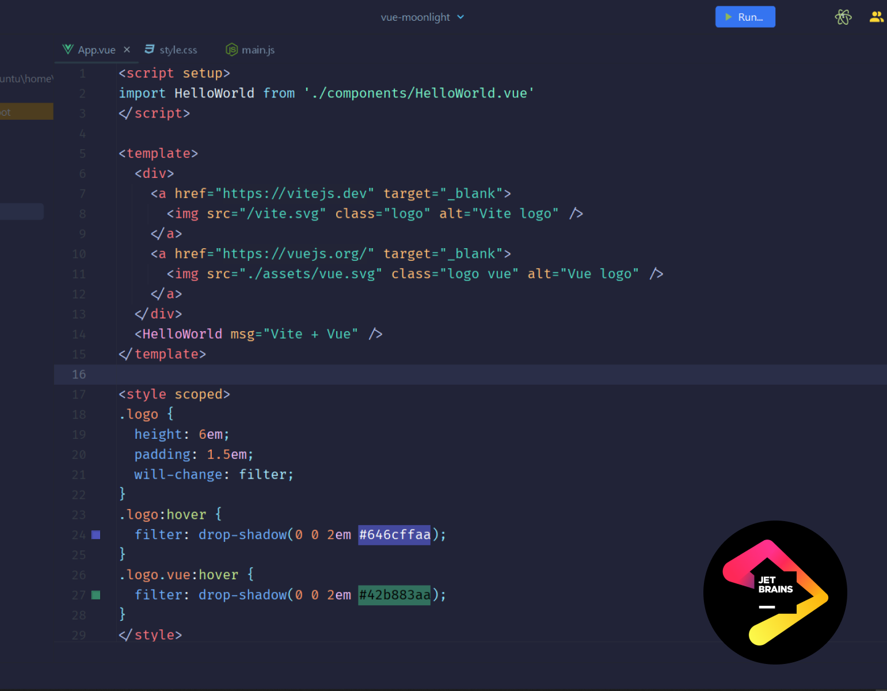
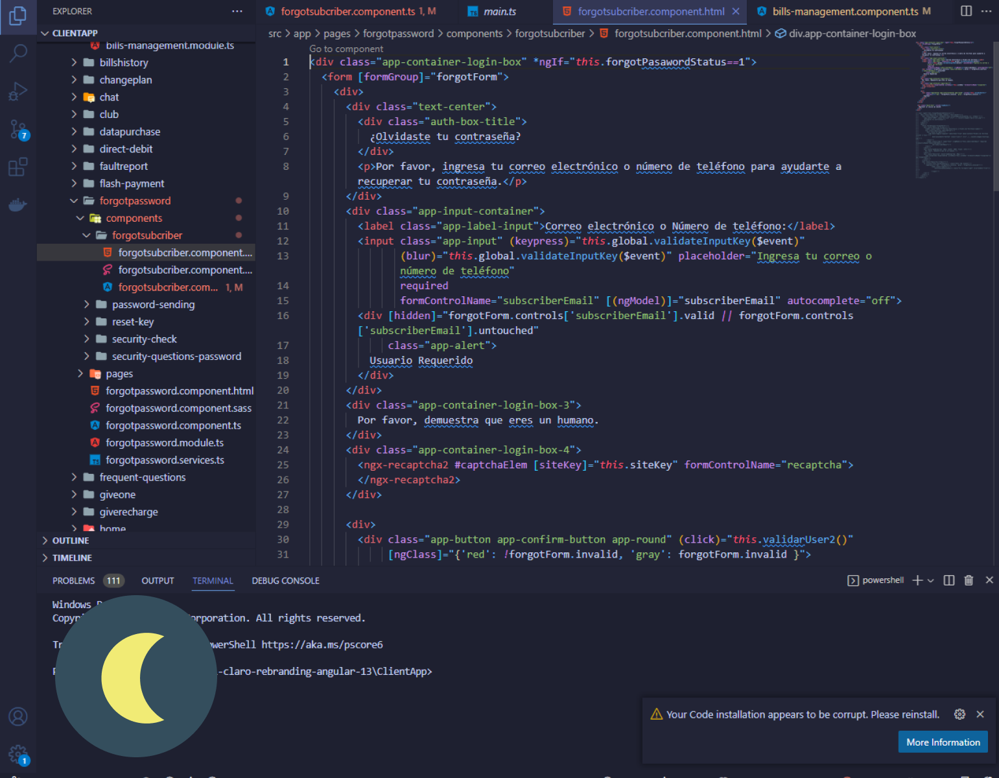

# Material Storm Theme 

VSCode Theme based on [Jetbrains Webstorm  Moonlight (Material)](https://plugins.jetbrains.com/plugin/18943-moonlight-dark-theme)

We keep making changes constantly to reach **full Workbench theming**

### Webstorm way

### Our way

## Installing

This extension is available for free in the [Visual Studio Code Marketplace](https://marketplace.visualstudio.com/items?itemName=AlexRodriguez.material-storm-theme)

## What's new?

Click here to go to the [Changelog](https://github.com/soyalexrc/material-storm-theme/blob/main/CHANGELOG.md)

## Customization

If you are using VSCode 1.12+ versions you can customize the colors to your liking, overriding the ones provided by this theme. More info [here.](https://code.visualstudio.com/api/references/theme-color)

## Custom font

You can easily [customize your settings](https://code.visualstudio.com/docs/getstarted/settings) to use it.
If you download and install the font in your system, you can add this option to have a custom font:

    {
        "editor.fontFamily": "YOUR FONT, Menlo, Monaco, Courier New, monospace"
    }

## Credits

[Jetbrains Webstorm  Moonlight (Material)](https://plugins.jetbrains.com/plugin/18943-moonlight-dark-theme)

**Enjoy!**
